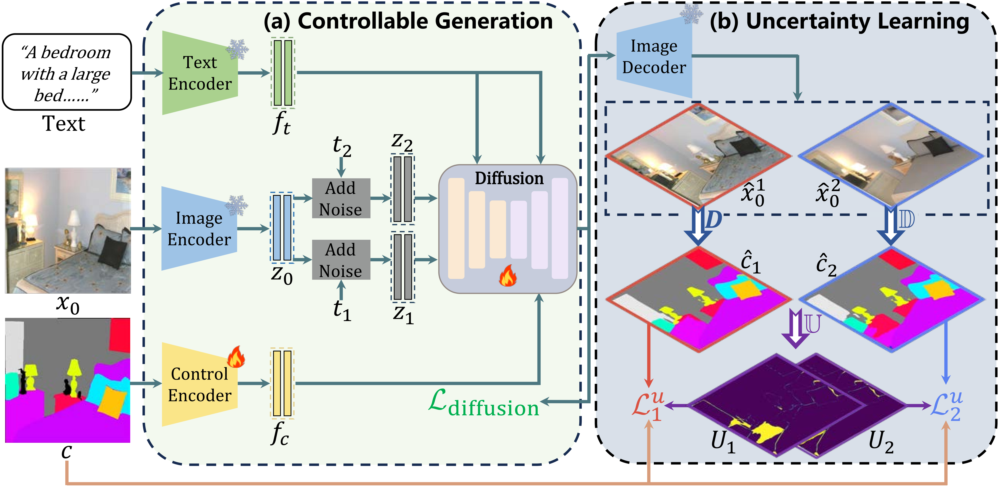

<div align ="center">
<h1> Ctrl-U </h1>
<h3> Robust Conditional Image Generation via Uncertainty-aware Reward Modeling </h3>
<div align="center">
</div>

[](https://grenoble-zhang.github.io/Ctrl-U-Page/)&nbsp;
[](https://arxiv.org/abs/2410.11236)&nbsp;
</div>

Authors: [Guiyu Zhang\*](https://scholar.google.com/citations?user=NLPMoeAAAAAJ/)<sup>1</sup>, [Huan-ang Gao\*](https://c7w.tech/about/)<sup>2</sup>, Zijian Jiang<sup>2</sup>, [Hao Zhao](https://sites.google.com/view/fromandto)<sup>2</sup>, [Zhedong Zheng†](https://www.zdzheng.xyz/)<sup>1</sup>

<sup>1</sup> FST, University of Macau&emsp;<sup>2</sup> AIR, Tsinghua University

## News
`[2025-1-22]:` Our Ctrl-U has been accepted by ICLR 2025 🚀 !
`[2024-10-14]:` We have released the [technical report of Ctrl-U](https://arxiv.org/abs/2410.11236). Code, models, and demos are coming soon!

## Overview

In this paper, we focus on the task of conditional image generation, where an image is synthesized according to user instructions. The critical challenge underpinning this task is ensuring both the fidelity of the generated images and their semantic alignment with the provided conditions. While previous methods have achieved commendable results through supervised perceptual losses, they directly enforce alignment between the condition and the generated result, ignoring that reward models often provide inaccurate feedback when encountering newly generated data, which can undermine the training process. Given the inherent cognitive uncertainty within reward models, we propose an uncertainty-aware reward modeling, called **Ctrl-U**, including **uncertainty estimation** and **uncertainty-aware regularization**, designed to reduce the adverse effects of imprecise feedback from the reward model.



Extensive experiments validate the effectiveness of our methodology in enhancing the controllability, achieving an impressive performance improvement over the prior state-of-the-art results by **44.42%** mIoU, **3.76%** SSIM, and **8.65%** RMSE respectively, for segmentation mask, hed edge, and depth conditions.

## License
This project is licensed under the Apache License 2.0 - see the [LICENSE](LICENSE.txt) file for details.

## Acknowledgments

Our work is based on the following open-source projects. We sincerely thank the contributors for thoese great works!

* [ControlNet](https://github.com/lllyasviel/ControlNet)
* [ControlNet++](https://github.com/liming-ai/ControlNet_Plus_Plus)
* [MMSegmentation](https://github.com/open-mmlab/mmsegmentation)
* [ImageReward](https://github.com/THUDM/ImageReward)

## Citation
If you find Ctrl-U is useful in your research or applications, please consider giving us a star ⭐ or cite us using:
```bibtex
@article{zhang2024ctrl,
  title={Ctrl-U: Robust Conditional Image Generation via Uncertainty-aware Reward Modeling},
  author={Zhang, Guiyu and Gao, Huan-ang and Jiang, Zijian and Zhao, Hao and Zheng, Zhedong},
  journal={arXiv preprint arXiv:2410.11236},
  year={2024}
}
```
